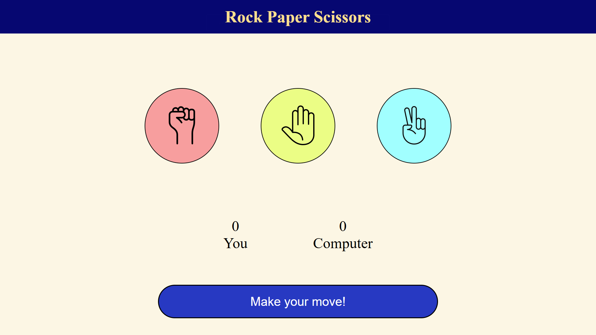

# Rock Paper Scissors

A simple and interactive Rock Paper Scissors game built using HTML, CSS, and JavaScript.  
The game allows a user to play against the computer with real-time result updates and a clean, responsive UI.

## 🔹 Features

- User vs Computer gameplay
- Dynamic result messages (win, lose, draw)
- Score tracking
- Responsive design for mobile and desktop
- Clean and minimal UI

## 🔹 Tech Stack

- HTML
- CSS
- JavaScript

## 🔹 How to Play

1. Choose Rock, Paper, or Scissors.
2. The computer makes a random choice.
3. The result is displayed instantly.
4. Scores update after each round.

## 🔹 Preview

  

## 🔹 What I Learned

- DOM manipulation using JavaScript
- Handling user events
- Implementing game logic
- Writing responsive CSS
- Cleaning and refactoring code

## 🔹 Future Improvements

- Animations
- Game history
